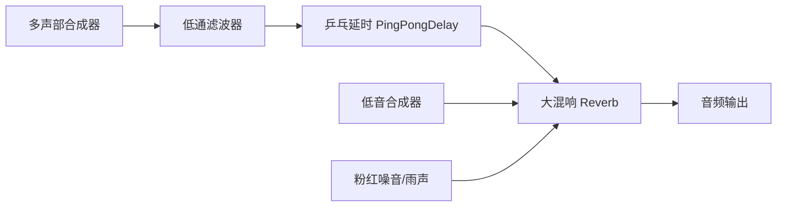

# 6.6 可视化音乐重构与生成式氛围音乐优化方案

## 1. 现状与痛点分析

在目前版本的 MoodWave 灵音中，治愈音乐房（`music/page.tsx`）是用户进行 AI 情绪疗愈的终点站，但其核心体验仍存在以下不足：

1. **听感机械单调**：
   - 现行机制使用 `Tone.Sequence` 机械地循环播放写死的 `profile.scale` 音符序列。
   - 音色（如 Sawtooth 或 Sine）未经过合理的延迟与大混响处理，听感呈现为呆板的电子单音，缺乏音乐性，长时间聆听易产生疲劳感。
   - 缺乏随机性，6 种情绪的音乐体验千篇一律，无法真正达到“舒缓、治愈”的环境音乐（Ambient Music）效果。

2. **视觉表现单薄**：
   - 现有的 Canvas 粒子仅在水平方向上做简单的走马灯移动，遇到画布右侧边界后重置到左侧。
   - 水波纹效果采用固定的正弦波曲线，缺少层次感与深度，缺乏梦幻的“赛博治愈（Cyber-Healing）”与“发光星云”的霓虹质感。
   - 中心的发光球（Orb）动画较为孤立，未与粒子系统及音乐节奏产生深度的共鸣交互。

---

## 2. 核心重构思路

为了在不强依赖外部版权曲库（如网易云/QQ音乐 API）的前提下，最大化突出产品的“AI 疗愈”属性，我们将音乐与视觉系统重构为**生成式环境氛围音乐（Generative Ambient Music）**与**中心辐射型星云粒子视觉系统**。

### 方案灵感与技术参考
* **Brian Eno 经典生成式算法**：采用多重互质周期（非整倍数）的异步循环轨道。各轨道以不同概率、在不同时间触发单音，使音符在相位上不断漂移，生成**永不重复、无穷无尽**的氛围旋律。
* **五声音阶（Pentatonic Scale）乐理**：五声音阶不含半音冲突，任意两个音符同时或先后鸣响都能保持高度协和，非常适合由算法随机挑选演奏。
* **CodePen 粒子动力学与极光融合**：利用 Canvas 的 `globalCompositeOperation = 'lighter'` 混合模式，让辐射发散的粒子在交汇处产生发白泛光的梦幻“星云”视效。

---

## 3. 详细设计方案

### 3.1 生成式环境氛围音乐系统（基于 Tone.js）

我们将重构音频节点连接链路，并引入空间效果器，具体配置如下：

#### A. 空间效果链路设计


* **PingPongDelay（乒乓延时）**：设置 `delayTime: "0.3s"` 或 `0.4s`，`feedback: 0.6`。它能让音符在左右声道之间来回跳跃漂移，瞬间拓宽声场。
* **Reverb（大混响）**：设置 `decay: 6.0`（6 秒超长衰减），`wet: 0.5`（湿混比 50%）。长混响能将零散的单音渲染成如梦如幻的和弦背景，提供辽阔的空间包裹感。

#### B. 6 种情绪的五声音阶与音色映射
为了让每种情绪拥有独特的听觉基调，我们将重新设计音阶与配器参数：

| 情绪 (Mood) | 推荐音阶 (Pentatonic Scale) | 基础 BPM | 合成器波形与参数 | 氛围辅助音效 |
| :--- | :--- | :--- | :--- | :--- |
| **happy (喜悦)** | **C Major Pentatonic**<br>`['C4', 'D4', 'E4', 'G4', 'A4', 'C5', 'E5']` | 110 | `triangle`<br>音色明亮、泛音丰富 | 轻快的微风风铃节奏（高频段随机触发） |
| **calm (平静)** | **G Major Pentatonic**<br>`['G3', 'A3', 'B3', 'D4', 'E4', 'G4']` | 65 | `sine`<br>纯净、圆润的纯弦波 | 缓慢起伏的海洋潮汐律动（低频滤波扫描） |
| **anxious (焦虑)** | **A Minor Pentatonic**<br>`['A3', 'C4', 'D4', 'E4', 'G4', 'A4']` | 85 | `sine`<br>柔和、无压力的音色 | **Pink Noise（粉红噪声）** 过滤出的白噪音，模拟雨声，用于安神降噪 |
| **angry (愤怒)** | **D Minor Pentatonic**<br>`['D3', 'F3', 'G3', 'A3', 'C4', 'D4']` | 75 | `sine` / `triangle`<br>偏低沉温暖的包裹音色 | 类似心跳的超低频脉冲（Warm Bass Pulse），帮助释放张力 |
| **sad (悲伤)** | **C Minor Pentatonic**<br>`['C3', 'Eb3', 'F3', 'G3', 'Bb3', 'C4']` | 55 | `sine`<br>略带忧郁色彩的协和音程 | 模拟远方滴水声（长延迟单音，极低触发概率） |
| **neutral (中性)**| **E Minor Pentatonic**<br>`['E3', 'G3', 'A3', 'B3', 'D4', 'E4']` | 75 | `triangle`<br>温和、朴素的自然音色 | 均匀细碎的沙锤或森林风声（极轻的随机颗粒） |

#### C. 三重异步 Loop 触发算法
替换掉原本死板的 `Sequence` 循环，我们新设 3 个并行 Loop：
* **Loop A (高音风铃，周期 3.2s)**：每次触发时有 35% 概率随机播放音阶中的一个高音，音量在 `0.2 ~ 0.5` 随机，并带有一点音高的微幅随机偏置（Detune），营造风铃随风摆动的灵动感。
* **Loop B (中音旋律，周期 4.7s)**：每次触发时有 40% 概率播放中音区的和弦外音，负责勾勒出空灵的主旋律。
* **Loop C (低音铺底，周期 7.3s)**：负责在小节交界处弹奏根音（Root Note），持音时间长（如 4 秒），为整个空间垫底。

---

### 3.2 极光星云视觉效果系统（基于 Canvas API）

重构 Canvas 的粒子动力学公式与图层渲染顺序，实现更加迷幻的视觉质感：

#### A. 中心辐射型粒子动力学
* **初始诞生点**：所有粒子从画布中心点（即 `width * 0.5, height * 0.4`，Orb 的位置）诞生。
* **极坐标移动**：每个粒子在初始化时被赋予一个随机方向角 $\theta \in [0, 2\pi]$ 以及随机发射速度 $v$。每帧的运动方程为：
  $$x = x + v \cdot \cos(\theta) \cdot \text{energy}$$
  $$y = y + v \cdot \sin(\theta) \cdot \text{energy}$$
* **生命周期衰减**：每个粒子拥有 `life` 和 `maxLife`（如 100 ~ 200 帧）。每帧 `life` 递减。
* **透明度平滑映射**：粒子的绘制透明度设为 $\alpha = \frac{\text{life}}{\text{maxLife}}$。当粒子向外扩散逐渐变暗、衰亡后（`life <= 0`），在中心重新初始化诞生，保证画面粒子总数守恒，且运动如生生不息的宇宙星云。

#### B. 极光星云渲染（Composite Blending）
* 在绘制前，设置 `ctx.globalCompositeOperation = 'lighter'`。该模式下，重叠部分的颜色值会进行相加运算。
* 当数十个带有发光阴影（`shadowBlur = 12`, `shadowColor = profile.color`）的半透明粒子在中心重叠或在外围交错时，重叠区域会产生泛白发光的梦幻亮斑，表现出极光和发光星云的流体质感。
* 移除原本横跨屏幕的 4 层生硬的实心正弦波浪，改用半透明的、向外晕染发光的渐变层。

#### C. 共振光环（Resonant Waves）
* 在中心 Orb 的外围绘制 2 ~ 3 圈同心半透明光环。
* 光环的半径在基础值上，随时间正弦微幅波动：
  $$R = R_{\text{base}} + \sin(t \cdot 1.5) \cdot 10 \cdot \text{energy}$$
* `energy` 随当前音乐的触发和强度而变动。当高音风铃响起时，光环向外扩散并淡出，视觉上完美呼应乐音的共振。

---

## 4. 关键代码改造预览

### 4.1 音频内核 `startMusic` 改造

```typescript
// frontend/src/app/music/page.tsx - startMusic 核心片段
const startMusic = useCallback(async () => {
  setIsLoading(true)
  try {
    const Tone = toneRef.current ?? (await import("tone/build/esm/index"))
    toneRef.current = Tone
    await Tone.start()
    stopMusic()

    Tone.Transport.bpm.value = currentBpm

    // 1. 创建空间效果器
    const reverb = new Tone.Reverb({ decay: 5.5, wet: 0.45 }).toDestination()
    const delay = new Tone.PingPongDelay({
      delayTime: "0.4s",
      feedback: 0.58,
      wet: 0.35
    }).connect(reverb)
    const filter = new Tone.Filter(350 + intensity * 60, "lowpass").connect(delay)

    reverbRef.current = reverb
    filterRef.current = filter

    // 2. 实例化多声部合成器，使用长释放包络
    synthRef.current = new Tone.PolySynth(Tone.Synth, {
      oscillator: { type: profile.wave },
      envelope: { attack: 0.3, decay: 0.5, sustain: 0.6, release: 2.5 },
      volume: -16,
    }).connect(filter)

    // 低音合成器
    bassRef.current = new Tone.MonoSynth({
      oscillator: { type: "sine" },
      envelope: { attack: 0.8, decay: 1.0, sustain: 0.8, release: 3.0 },
      volume: -22
    }).connect(reverb)

    // 焦虑情绪的白/粉红噪音
    if (mood === "anxious") {
      noiseRef.current = new Tone.NoiseSynth({
        noise: { type: "pink" },
        envelope: { attack: 1.0, decay: 0.5, sustain: 0.4, release: 2.0 },
        volume: -32
      }).connect(reverb)
    }

    const scale = profile.scale

    // 3. 异步多重生成式 Loop 机制
    // Loop A: 高音风铃 (快节奏、低触发概率)
    const loopA = new Tone.Loop((time) => {
      if (Math.random() < 0.4) {
        // 从音阶的高音部分随机挑选
        const randomNote = scale[Math.floor(Math.random() * (scale.length - 2)) + 2]
        // 随机向上平移一个八度
        const finalNote = Math.random() < 0.2 ? Tone.Frequency(randomNote).transpose(12).toNote() : randomNote
        const vel = 0.25 + Math.random() * 0.3
        synthRef.current?.triggerAttackRelease(finalNote, "4n", time, vel)
      }
    }, "4n").start(0)

    // Loop B: 中音旋律 (慢节奏、中触发概率)
    const loopB = new Tone.Loop((time) => {
      if (Math.random() < 0.5) {
        const randomNote = scale[Math.floor(Math.random() * scale.length)]
        const vel = 0.35 + Math.random() * 0.35
        synthRef.current?.triggerAttackRelease(randomNote, "2n", time, vel)
      }
    }, "2n").start(0)

    // Loop C: 低音铺底 (超慢节奏、高触发概率)
    const loopC = new Tone.Loop((time) => {
      if (Math.random() < 0.8) {
        const baseNote = scale[0] // 根音
        bassRef.current?.triggerAttackRelease(baseNote, "1m", time, 0.45)
      }
      // 如果是焦虑情绪，周期性淡入淡出粉噪模拟呼吸
      if (noiseRef.current && Math.random() < 0.6) {
        noiseRef.current.triggerAttackRelease("1m", time, 0.15)
      }
    }, "1m").start(0)

    loopRef.current = {
      dispose: () => {
        loopA.dispose()
        loopB.dispose()
        loopC.dispose()
      }
    }

    Tone.Transport.start()
    setIsPlaying(true)
    setElapsedTime(0)
  } catch (err) {
    console.error("Failed to start Tone.js:", err)
  } finally {
    setIsLoading(false)
  }
}, [currentBpm, intensity, mood, profile, stopMusic])
```

### 4.2 Canvas `draw` 粒子更新与渲染改造

```typescript
// 粒子数据结构定义
type NebulaParticle = {
  x: number
  y: number
  originX: number
  originY: number
  angle: number
  speed: number
  radius: number
  life: number
  maxLife: number
  color: string
}

// Canvas draw 方法核心逻辑
const draw = (time: number) => {
  const rect = canvas.getBoundingClientRect()
  const width = rect.width
  const height = rect.height
  const t = time / 1000
  
  // 运动能量受播放状态及情绪强度共同控制
  const energy = isPlaying ? profile.pulse + intensity / 10 : 0.35

  // 1. 清理画布并绘制微弱的渐变底色
  context.clearRect(0, 0, width, height)
  context.fillStyle = "rgba(10, 10, 10, 0.95)" // 采用深色背景突出霓虹星云效果
  context.fillRect(0, 0, width, height)

  const centerX = width * 0.5
  const centerY = height * 0.4

  // 2. 启用 Lighter 混合模式进行星云粒子叠加
  context.globalCompositeOperation = "lighter"

  // 3. 更新并绘制辐射粒子
  particlesRef.current.forEach((p: any) => {
    // 运动方程
    p.x += Math.cos(p.angle) * p.speed * energy
    p.y += Math.sin(p.angle) * p.speed * energy
    p.life -= 1

    // 渐变淡出
    const alpha = Math.max(0, p.life / p.maxLife)
    const curRadius = p.radius * (0.4 + alpha * 0.6)

    context.beginPath()
    context.arc(p.x, p.y, curRadius, 0, Math.PI * 2)
    
    // 霓虹发光阴影
    context.shadowBlur = 12 * alpha
    context.shadowColor = profile.color
    
    context.fillStyle = `rgba(${hexToRgb(profile.color)}, ${alpha * 0.65})`
    context.fill()

    // 粒子死亡重置
    if (p.life <= 0) {
      p.x = centerX
      p.y = centerY
      p.angle = Math.random() * Math.PI * 2
      p.speed = 0.5 + Math.random() * 2.0
      p.radius = 1.5 + Math.random() * 5.0
      p.life = 80 + Math.random() * 120
      p.maxLife = p.life
    }
  })

  // 4. 恢复 normal 模式绘制中心 Orb 和共振光环，避免光环把背景全部刷白
  context.globalCompositeOperation = "source-over"
  context.shadowBlur = 0 // 重置阴影

  // 绘制中心共振光环
  for (let i = 0; i < 3; i++) {
    const ringRadius = (55 + i * 35) + Math.sin(t * 2.0 + i) * 8 * energy
    const ringAlpha = (0.25 - i * 0.08) * (isPlaying ? 1.0 : 0.5)
    context.beginPath()
    context.arc(centerX, centerY, ringRadius, 0, Math.PI * 2)
    context.strokeStyle = `rgba(${hexToRgb(profile.color)}, ${ringAlpha})`
    context.lineWidth = 2
    context.stroke()
  }

  // 绘制最中心的 Orb 呼吸球
  const orbRadius = 45 + Math.sin(t * 1.5) * 6 * energy
  const orbGradient = context.createRadialGradient(centerX, centerY, 5, centerX, centerY, orbRadius)
  orbGradient.addColorStop(0, "rgba(255, 255, 255, 0.95)")
  orbGradient.addColorStop(0.4, `rgba(${hexToRgb(profile.color)}, 0.8)`)
  orbGradient.addColorStop(1, "rgba(0, 0, 0, 0)")
  
  context.beginPath()
  context.arc(centerX, centerY, orbRadius, 0, Math.PI * 2)
  context.fillStyle = orbGradient
  context.fill()

  animationRef.current = window.requestAnimationFrame(draw)
}
```

> **注**：其中 `hexToRgb` 为辅助工具函数，用于将 `#FFFFFF` 格式色值转换为 `r, g, b` 数组，以便控制 Alpha 通道。

---

## 5. 改造步骤与路线图 (Roadmap)

为了稳妥、快速地在当前项目中落地此方案，我们将按以下步骤进行重构：

1. **第一步：方案归档与确认（当前步骤）**
   - 编写本方案到项目 `docs/` 目录，供主协作者及评委审阅项目技术文档。
   
2. **第二步：编写辅助函数与准备工作**
   - 在 `music/page.tsx` 中加入 `hexToRgb` 等颜色解析辅助函数，解决 CSS HEX 颜色在 Canvas 渐变透明度（rgba）应用中的转换问题。

3. **第三步：重构音频播放内核 (`startMusic` & `stopMusic`)**
   - 引入 `Tone.PingPongDelay` 并调整 Reverb 混响衰减。
   - 废除原 Sequence 单音循环播放，用三重异步 `Tone.Loop` 配合概率判定和五声音阶选择，形成生成式音轨。

4. **第四步：重构 Canvas 粒子更新逻辑**
   - 重新编写 Canvas `resize` 和粒子初始化逻辑，使粒子从屏幕中心 Orb 处以随机角向外发射。
   - 修改 `draw` 渲染方法，利用 `globalCompositeOperation = 'lighter'` 及 `shadowBlur` 绘制霓虹极光重叠光斑。
   - 加入中心 Orb 的多重共振光圈。

5. **第五步：真机及打包测试**
   - 运行本地开发环境进行声画调试，确保 6 种情绪的听觉氛围与视觉粒子色彩完美匹配。
   - 运行 `npm run build`，确保无打包时类型报错及 Hydration 冲突，完成优化闭环。
