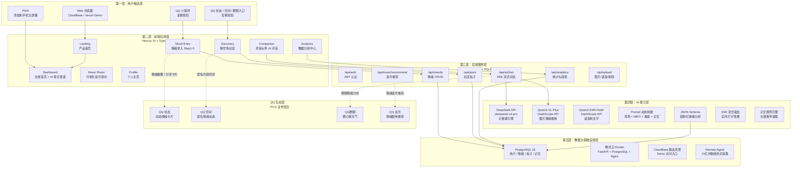

# MoodWave — 基于 AI 的情绪分析与可视化音乐治愈平台

> **官方模板版本** — 腾讯 PCG 校园 AI 产品创意大赛 初赛说明文档
> **命名规范**: `选手名_开放赛道_MoodWave_Demo演示.pdf`
> **提交截止**: 2026 年 5 月 6 日

---

# 封面页

| 栏目 | 填写内容 |
|------|----------|
| **作品名称** | MoodWave — 基于 AI 的情绪分析与可视化音乐治愈平台 |
| **参赛赛道** | 开放赛道 |
| **选手姓名** | [姓名] |
| **Demo 链接** | https://moodwave-253244-5-1384822044.sh.run.tcloudbase.com/ |

> `[封面图占位]` — A4 竖版封面待生成，配色参考 CloudBase 部署页与 MoodWave 主题色（柔蓝 `#6366f1` + 深蓝/深紫蓝渐变背景），中央留白写作品名称与参赛信息。

**封面生成提示词（设计/AI 生图可直接使用）**:

> 设计一张 A4 竖版封面（210mm × 297mm），用于中国大学生 AI 产品创意大赛初赛说明文档。作品名称为「MoodWave — 基于 AI 的情绪分析与可视化音乐治愈平台」。整体视觉风格为温柔的赛博治愈感，背景采用柔和深蓝到深紫蓝渐变（`#0f172a` → `#1a1a2e`），加入靛蓝色发光点缀（`#6366f1`、`#818cf8`）和少量暖月黄色/琥珀色高光，呼应“月光”“潮汐”“情绪音乐可视化”的主题。画面中可加入抽象流动波纹、细小粒子、柔和光晕和音乐可视化线条，但不要过度复杂。中央保留干净留白，用于排版作品名称、开放赛道、选手姓名占位符和 Demo 链接。顶部放置简洁的 MoodWave 波浪 Logo 标志占位。底部放置 slogan：「记录情绪的潮汐，遇见内心的风景」。整体应高级、现代、治愈、清透，不压抑，不使用卡通吉祥物，不要杂乱，不要纯黑重背景。字体气质参考 PingFang SC + Montserrat/Outfit，适合导出为正式 PDF 封面。

---

# 模块一：用户洞察与问题定义

## 1.1 目标用户

**核心用户群体**: 在校大学生及研究生（18-25 岁）

以下 5 个用户画像综合自腾讯问卷 105 份有效样本、小红书情绪雷达 88+ 条真实帖子，以及问卷 Q18 开放建议。画像既覆盖焦虑、孤独、情感困扰等高频负面情绪，也保留积极情绪记录需求，避免将情绪管理简化为“只处理低谷”。

---

### 画像 1：考研焦虑型 — 小杨

| 维度 | 详情 |
|------|------|
| **基本特征** | 大四，某 211 高校计算机专业，22 岁，MBTI: INTJ |
| **情绪现状** | 二战考研倒计时 60 天，每天图书馆 12 小时。同伴压力明显，看到研友的复习进度会立刻心慌 |
| **典型一天** | 6:30 起床 → 图书馆 → 午休时刷到“考研还剩 X 天”帖子 → 焦虑 → 下午效率下降 → 晚上自责“又浪费了一天” |
| **现有应对** | 偶尔和研友吐槽，但怕传播焦虑；晚上刷手机到 1 点，越刷越睡不着 |
| **真实数据佐证** | 问卷：72.4% 的焦虑来自就业/考研；小红书："考研焦虑睡不着"、"二战考研失败决定放过自己"、"985 学生也有学业焦虑" |

> “我不需要长篇大论的分析，我就想快速记一下今天好焦虑，然后有人告诉我怎么办。”（问卷 Q18 开放建议提炼）

---

### 画像 2：情感困惑型 — 小陈

| 维度 | 详情 |
|------|------|
| **基本特征** | 大二，文科专业，20 岁，MBTI: INFP |
| **情绪现状** | 两个月前分手，表面上说“走出来了”，但深夜经常情绪反刍。不敢反复向朋友倾诉，担心显得“矫情” |
| **典型一天** | 白天正常上课，晚上躺床上刷到前任动态 → 失眠 → 在社交媒体打下大段文字又删掉 |
| **现有应对** | 听网易云 emo 歌单，但越听越难过；偶尔发小红书匿名帖倾诉 |
| **真实数据佐证** | 问卷：22.9% 受情感问题困扰；小红书："分手孤独"帖获 104 条评论，共鸣极强；Q18 建议："想要一个只属于自己的情绪树洞" |

---

### 画像 3：家庭压力型 — 小周

| 维度 | 详情 |
|------|------|
| **基本特征** | 大三，经管专业，21 岁，MBTI: ESFJ |
| **情绪现状** | 父母期望她考研/考公/进体制，但她想去互联网公司实习。每次电话回家都吵架，报喜不报忧已成习惯 |
| **典型一天** | 白天投实习简历被拒 → 晚上妈妈打电话说“你表姐考上公务员了” → 挂了电话想哭但哭不出来 |
| **现有应对** | 和闺蜜吐槽，但闺蜜也在焦虑自己的事；发微博小号但没人回应 |
| **真实数据佐证** | 问卷：20.0% 受家庭问题困扰；小红书：父母期望与个人理想冲突类帖子情绪强度高 |

---

### 画像 4：社交孤独型 — 小赵

| 维度 | 详情 |
|------|------|
| **基本特征** | 大一，理科专业，19 岁，MBTI: ISFP |
| **情绪现状** | 高敏感，在人群中容易消耗能量。想交朋友但不擅长主动，经常一个人吃饭 |
| **典型一天** | 课堂上不敢提问 → 午饭一个人吃，看到别人成群结队 → 晚上在 QQ 群里潜水看别人聊天 → 想发消息又担心冷场 |
| **现有应对** | 刷小红书看"高敏感生存指南"→ 打游戏逃避 |
| **真实数据佐证** | 问卷：32.4% 受人际关系困扰，47.6% 自我否定；小红书："焦虑内耗"、"高敏感"为高频话题；Q18："想要一个没有压力的社交空间" |

---

### 画像 5：小确幸记录型 — 小苏

| 维度 | 详情 |
|------|------|
| **基本特征** | 大二，设计专业，20 岁，MBTI: ENFP |
| **情绪现状** | 情绪丰富但容易波动，有好玩的事会特别开心（拿到实习 offer、和好朋友出去玩），但过了当下就很快被新的压力覆盖 |
| **典型一天** | 今天帮同学改简历被夸 → 很开心 → 晚上刷到焦虑内容 → 积极情绪被冲淡 → 想回顾“今天其实挺好的”，但没有轻量记录入口 |
| **现有应对** | 发朋友圈但分组可见；想要一个"快乐存档"功能但不想要复杂日记 |
| **真实数据佐证** | 小红书有大量正向帖子（"今天做了一件很勇敢的事"、"一个人去看海啦"）；PRD 快乐能量库功能直接响应该需求 |

---

## 1.2 用户痛点

### 痛点 1：负面情绪高频但缺乏日常管理工具

| 数据来源 | 证据 |
|----------|------|
| 腾讯问卷 N=105 | 78.1% 每周至少 1 次负面情绪，14.3% 每周 3 次以上 |
| 小红书情绪雷达 N≈88 | "考研焦虑睡不着"、"越压抑越崩溃"、"内耗上火"等帖子情绪强度高 |
| Q18 开放建议 | "情绪不好的时候反而不想看复杂的东西" |

**结论**：用户并非没有情绪管理意识，而是缺少低门槛、低压力、能持续使用的日常工具。现有方式要么效果有限（刷手机越刷越焦虑），要么伴随社交压力（发朋友圈怕被评价）。

---

### 痛点 2：想记录但现有工具太麻烦，记录了也没反馈

| 数据来源 | 证据 |
|----------|------|
| 腾讯问卷 Q10 | "记录太麻烦，打字太累不想记"排名第一的弃用原因 |
| 腾讯问卷 Q10 | "记录了也没什么用，没有反馈或建议"排名第二 |
| Q18 开放建议 [24号] | "不用太复杂的操作，打开就能记录最好" |

**结论**：用户要的不是一本功能复杂的电子日记本，而是一个“30 秒完成表达，并立即获得回应”的情绪出口。现有 App 要么功能过多、路径过长，要么只负责保存记录，缺少分析和反馈。

---

### 痛点 3：想倾诉但怕打扰朋友、怕暴露隐私

| 数据来源 | 证据 |
|----------|------|
| 腾讯问卷 Q7 | 25.7% 选择"转移注意力"（不找人倾诉），19.0% 选择"独处消化" |
| 腾讯问卷 Q7 | 仅 12.4% 选择"有人安静听我倾诉"——不是不想倾诉，是不敢 |
| 小红书 | "分手孤独"帖 104 条评论，说明用户愿意在匿名环境表达 |
| Q18 [51号] | "低压力、极简、重隐私" |

**结论**：深夜最需要表达的时刻，朋友未必在线；用户需要一个稳定、私密、低评判感的倾诉对象。

---

### 痛点 4：想了解自己的情绪规律但缺少数据洞察

| 数据来源 | 证据 |
|----------|------|
| 腾讯问卷 Q16 | 38.1% 对"情绪数据可视化"感兴趣（功能需求排第 2） |
| 腾讯问卷 Q16 | 30.5% 对"MBTI 个性化推荐"感兴趣 |
| Q18 [40号] | "像豆包一样能记住我，逐步了解我" |

**结论**：用户不仅想记录，还想“看见”自己的情绪模式：什么时候容易焦虑、什么事件触发低落、哪种调节方式真正有效。传统日记 App 多停留在列表展示，难以提供可解释的数据洞察。

---

## 1.3 使用场景

### 场景一：晚自习后的考研焦虑时刻

> **时间**: 晚上 10 点，从图书馆回宿舍的路上
> **人物**: 小杨（大四考研，INTJ）
> **情境**: 今天只完成了计划的一半，数学真题错了很多。想到还有 60 天考研，压力突然涌上来。她打开微信想和朋友说，打出三行又删掉：“算了，大家也都很忙。”
> **使用 MoodWave**:
> 1. 打开 MoodWave（手机浏览器，PWA 已安装到主屏幕）
> 2. Dashboard 显示 AI 问候：“小杨，今天辛苦了。你连续记录了 23 天，很了不起。”
> 3. 点击"记录情绪" → 选择"焦虑" → 强度 7
> 4. 语音输入：“今天数学真题错了好多，感觉考不上了，好慌。”
> 5. AI 分析（3 秒后返回）：“你的焦虑主要来自‘对结果的担忧’和‘与他人的比较’。你过去一周有 4 天是焦虑状态，但上周四你说‘今天终于做对了一道难题’，这说明你仍在进步。”
> 6. 进入音乐可视化房间：Canvas 粒子随低频治愈音乐缓慢流动，极光蓝波纹扩散
> 7. 5 分钟后心情平复，返回 Dashboard

---

### 场景二：QQ 群聊里的情绪共振（PCG 业务结合场景）

> **时间**: 考试周，晚上 11 点
> **人物**: 小赵（大一，ISFP）和她的班级 QQ 群
> **情境**: 班级 QQ 群里大家深夜赶作业，聊天记录里充满了“好累”“要崩溃了”“还有两篇论文没写”。小赵想加入吐槽，但打了字又删掉。
> **使用 MoodWave（QQ 生态整合版）**:
> 1. 群管理员开启了"群心情天气"功能
> 2. AI 分析群内近 2 小时发言，检测到大量负面情绪表达
> 3. 生成“本群今日心情：阵雨，67% 成员感到焦虑”
> 4. 小赵看到后发了一条消息：“原来大家都焦虑啊……”
> 5. 群友陆续回应：“看到这个我至少知道自己不是一个人。”
> 6. 小赵点击群公告里的 MoodWave 链接 → 快速记录了自己的情绪 → AI 分析后获得调节建议
> 7. 她的情绪卡片（匿名）被同步到 QQ 空间——"来自群聊 2022 计科 3 班的心情天气"
> 8. 几个朋友给她点了“抱抱”——这不是要求同学立刻解决问题，而是让彼此知道：我看见了，我在这里。

---

# 模块二：产品方案设计

## 2.1 产品概述

**一句话概述**：MoodWave 是一款面向大学生的 AI 情绪健康管理平台，通过「30 秒快速记录 → AI 深度分析 → 可视化音乐治愈 → 数据驱动洞察」的闭环体验，帮助年轻人记录、理解并管理自己的情绪。

**产品形态**: Web 应用 + PWA（可安装到手机主屏幕，体验接近原生 App）+ 响应式设计（手机/平板/PC 自适应）

**做什么**: 让用户以最低门槛（选表情、说句话、拍张照）记录情绪，AI 实时分析并给出个性化反馈，再通过可视化音乐帮助用户缓解情绪，让情绪数据变得可看见、可理解。

**怎么做**: 以 DeepSeek AI 驱动情绪分析引擎，结合 Tone.js 音乐生成、Canvas 粒子动画和 Recharts 数据可视化。技术栈采用 Next.js 14（前端）+ Python FastAPI（后端）+ PostgreSQL（数据持久化）。

**PCG 业务结合**: 产品设计预留 QQ 生态融合接口。情绪分析结果可同步至 QQ 状态（动态情绪卡片）、QQ 空间（匿名情绪动态）和 QQ 群聊（群心情天气），将情绪管理从“个人记录”延展为“社交情绪感知”。

---

## 2.2 核心功能

| 模块 | 核心功能 | 解决什么痛点 | PCG 业务结合 |
|------|----------|-------------|-------------|
| **情绪录入** | 6 种情绪选择 + 1-10 强度滑块 + 文字/图片/语音三种输入 + 标签分类，5 步 30 秒完成 | "记录太麻烦" | — |
| **AI 情绪分析** | DeepSeek 实时分析日记文本，返回：情绪类型与可信度、强度判断、高频关键词、个性化调节建议 | "记录了没反馈" | AI 分析结果可推送至 QQ 消息（类似 QQ 小助手提醒） |
| **可视化音乐** | 情绪→Tone.js 生成氛围音乐 + Canvas 粒子动画实时渲染，6 种情绪对应 6 套独立视觉参数 | "不知道怎么缓解" | 未来对接 QQ 音乐 SDK，情绪→QQ 音乐歌单推荐 |
| **灵音伙伴** | 7 个可选 AI 虚拟角色（小喵/小狐狸/小星球等），有记忆系统、有个性、可捏脸，SSE 流式对话 | "缺乏情感连接" | 可设为 QQ 聊天背景/AI 陪伴助手，类似 QQ 宠物升级版 |
| **数据分析** | 30 天情绪趋势折线图 + 年热力日历 + 情绪分布饼图 + MBTI 交叉分析 | "不了解自己的情绪规律" | — |
| **解忧角** | 匿名轻社交社区，帖子流 + 调解者角色 + 正向反馈（抱抱/感谢/锦旗），弱互动设计 | "孤独感 + 隐私担忧" | 灵感内容可一键同步 QQ 空间（匿名/实名可选） |
| **QQ 状态同步** | 情绪日记→生成动态情绪状态卡片→同步 QQ 状态/QQ 空间/群聊 | "想分享又怕尴尬" | **PCG 核心结合点** |
| **群心情天气** | AI 分析群聊发言情绪 → 生成"本群今日心情"报告（规划中） | "群体的情绪共鸣需求" | **PCG 核心结合点**，增强 QQ 群归属感 |

---

## 2.3 产品架构/功能图

MoodWave 采用“五层产品架构 + QQ 生态侧向接入”的设计。当前 MVP 已完成 Web/PWA 主链路，QQ 状态、QQ 空间、QQ群聊与 QQ 音乐属于复赛阶段规划能力，但在数据结构、AI Pipeline 与分享入口上已提前预留接口。

**架构图生成提示词（可用于 Codex Image2 / GPT Image / 设计工具）**:

> 生成一张横版 16:10 中文产品架构图，主题为「MoodWave 产品架构 / 五层架构 + QQ 生态接入」。画面风格必须与 MoodWave 当前前端和前两张场景图一致：温柔治愈、奶白渐变背景、浅粉 `#ffb4c4`、薄荷绿 `#8de1d5`、浅紫 `#d4c8ff`、少量柔蓝 `#6366f1` 光效，使用玻璃拟态卡片、轻柔波纹、细小粒子、月光感光晕。不要做成深色科技大屏，不要纯黑背景，不要过度商业 PPT 风。整体应清透、柔和、可读，适合插入 A4 竖版 PDF。
>
> 图中采用「从左到右或从上到下的五层架构 + 右侧 QQ 生态层」布局。每一层用一张半透明玻璃卡片承载，卡片之间用柔和渐变箭头连接，右侧 QQ 生态层用虚线连接到相关模块。
>
> 第一层：「用户触达层」  
> 内容：Web 浏览器、PWA、QQ 小程序（规划中）、QQ 状态/空间/群聊入口（规划中）
>
> 第二层：「前端应用层」  
> 副标题：Next.js 14 + TypeScript + Tailwind CSS  
> 内容：Landing、Dashboard、情绪录入、音乐房间、数据分析、灵音伙伴、解忧角、Profile
>
> 第三层：「后端服务层」  
> 副标题：Python FastAPI + SQLModel  
> 内容：auth、moods、ai/chat、analytics、posts、music/recommend、upload
>
> 第四层：「AI 能力层」  
> 内容：DeepSeek API、SSE 流式响应、Prompt 动态构建、JSON Schema 结构化分析、记忆规则引擎
>
> 第五层：「数据与基础设施层」  
> 内容：PostgreSQL 16、腾讯云 Docker、CloudBase 静态托管、Hermes Agent 数据采集
>
> 右侧单独放置：「QQ 生态层 / PCG 业务结合」  
> 内容：QQ 状态（动态情绪卡片）、QQ 空间（匿名情绪动态）、QQ群聊（群心情天气）、QQ 音乐（情绪歌单推荐）
>
> 视觉要求：标题清晰，中文文字必须准确可读；每层不要堆太多小字，可用图标辅助表达（浏览器、手机、AI 星光、数据库、云、聊天气泡、音符）；整体层级明确，评委扫一眼能理解「用户入口 → 前端体验 → 后端 API → AI 能力 → 数据基础设施 → QQ 生态延展」。

**思维导图生成提示词（可用于 Codex Image2 / GPT Image）**:

> 生成一张横版 16:10 中文思维导图，中心主题为「MoodWave 产品架构」。画面风格与 MoodWave 前端一致：奶白渐变背景、浅粉 `#ffb4c4`、薄荷绿 `#8de1d5`、浅紫 `#d4c8ff`、柔蓝 `#6366f1`，使用柔和圆角节点、玻璃拟态、轻微波纹粒子和月光感光晕。不要深色科技风，不要复杂线框，不要拥挤。
>
> 中心节点写「MoodWave 产品架构」，周围发散 6 个一级分支：
> 1. 用户触达层：Web 浏览器、PWA、QQ 小程序（规划中）、QQ 状态/空间/群聊入口（规划中）
> 2. 前端应用层：Landing、Dashboard、情绪录入、音乐房间、数据分析、灵音伙伴、解忧角、Profile
> 3. 后端服务层：auth、moods、ai/chat、analytics、posts、music/recommend、upload
> 4. AI 能力层：DeepSeek API、SSE 流式响应、Prompt 动态构建、JSON Schema、记忆规则引擎
> 5. 数据与基础设施层：PostgreSQL 16、腾讯云 Docker、CloudBase、Hermes Agent
> 6. QQ 生态层：QQ 状态、QQ 空间、QQ群聊、QQ 音乐
>
> 排版要求：每个一级分支使用不同但协调的柔和色块，节点文字清楚可读；中心节点略大但不要夸张；分支线条像柔和波纹，不要硬直黑线；整体适合放入 A4 竖版 PDF 的「产品架构/功能图」章节。画面必须让评委不看正文也能理解 MoodWave 的产品组成与 PCG/QQ 生态结合关系。

**XMind 思维导图结构建议**:

```text
MoodWave 产品架构
├── 用户触达层
│   ├── Web 浏览器
│   ├── PWA
│   ├── QQ 小程序（规划中）
│   └── QQ 状态 / 空间 / 群聊入口（规划中）
├── 前端应用层：Next.js 14 + TypeScript + Tailwind CSS
│   ├── Landing 产品首页
│   ├── Dashboard 治愈首页
│   ├── 情绪录入 Step1-5
│   ├── 可视化音乐房间
│   ├── 数据分析中心
│   ├── 灵音伙伴 AI 对话
│   ├── 解忧角社区
│   └── Profile 个人主页
├── 后端服务层：Python FastAPI + SQLModel
│   ├── /api/auth JWT 认证
│   ├── /api/moods 情绪 CRUD
│   ├── /api/ai/chat SSE 流式对话
│   ├── /api/analytics 数据统计
│   ├── /api/posts 社区帖子
│   ├── /api/music/recommend 音乐推荐
│   └── /api/upload 多媒体上传
├── AI 能力层
│   ├── DeepSeek API
│   ├── Prompt 动态构建
│   ├── JSON Schema 结构化分析
│   ├── SSE 流式输出
│   └── 记忆规则引擎
├── 数据与基础设施层
│   ├── PostgreSQL 16
│   ├── 腾讯云 Docker
│   ├── CloudBase 静态托管
│   └── Hermes Agent 小红书情绪热词采集
└── QQ 生态层（PCG 业务结合）
    ├── QQ 状态：动态情绪卡片
    ├── QQ 空间：匿名情绪动态
    ├── QQ 群聊：群心情天气
    └── QQ 音乐：情绪歌单推荐
```



**图示说明**:

- 用户首先通过 Web/PWA 进入 MoodWave，后续可扩展为 QQ 小程序和 QQ 生态入口。
- 前端负责完整体验闭环：情绪录入、AI 反馈、音乐治愈、数据复盘与轻社交。
- 后端通过 FastAPI 提供统一 API，并以 PostgreSQL 持久化用户、情绪、帖子和记忆数据。
- AI 能力层是产品核心，三级模型分工：DeepSeek（主推理引擎）+ Qwen3-VL-Plus（图片情绪推断）+ Qwen3-ASR-Flash（语音转录），通过 DashScope API 统一调度。
- QQ 生态层作为 PCG 结合方向，复用现有情绪分析 Pipeline，将个人情绪记录延展为状态、空间、群聊和音乐推荐场景。

---

## 2.4 交互流程

### 关键路径一：首次使用全流程

```
Landing Page [截图-01-Landing]
  │  (看到 78.1% 数据，点击"立即体验")
  ▼
登录/注册
  │  (邮箱注册 + JWT 认证)
  ▼
Dashboard [截图-02-Dashboard]
  │  (AI 问候："晚安，今天还好吗？"+ 中空情绪 Emoji)
  │  点击"记录今天的心情"
  ▼
情绪录入 Step1-2 [截图-03-Mood-Step1]
  │  选情绪(6 种霓虹 Emoji 卡片) → 调强度(1-10 渐变滑块)
  ▼
情绪录入 Step3-4 [截图-04-Mood-Step3]
  │  写文字/拍照/语音输入 → 选标签(学习/工作/社交/情感/身体)
  ▼
提交 → AI 分析 [截图-05-AI-Result]
  │  DeepSeek 返回：情绪解读 + 关键词 + 调节建议
  ▼
自动跳转音乐房间 [截图-06-Music]
  │  Canvas 粒子动画 + Tone.js 氛围音乐
  ▼
返回 Dashboard [截图-02-Dashboard]
  │  看到刚记录的数据 + 今日情绪卡片
  │  可选择：发布到解忧角 / 同步 QQ 状态
  ▼
可选：发布到解忧角 [截图-09-Discovery]
  │  匿名发布，获得抱抱/感谢等正向反馈
  ▼
可选：同步 QQ 状态 [截图-10-QQ-Sync]
  │  生成情绪卡片，可同步至 QQ 状态/空间
  ▼
可选：灵音伙伴对话 [截图-07-Companion]
  │  和 AI 虚拟角色聊聊今天的感受
  ▼
可选：查看数据分析 [截图-08-Analytics]
     趋势图 + 热力日历 + 情绪分布
```

### 关键路径二：每日快速记录

```
打开 App/PWA
  → Dashboard（AI 每日寄语 + "今天还没记录" 提示）
  → 点击情绪 Emoji（快速入口，跳过 Step1-2）
  → 写几句话/拍张照 → 提交
  → AI 分析（3 秒返回）
  → 返回 Dashboard（完成）
  耗时：< 60 秒
```

### 截图/原型图占位符清单（共 10 处，后续手动插入）

| 占位符 | 对应页面 | 截图/原型图说明 |
|--------|---------|----------------|
| `[截图-01-Landing]` | Landing Page | 产品首页，78.1% 数据大数字，CTA 按钮 |
| `[截图-02-Dashboard]` | Dashboard | 治愈首页，AI 问候 + 中央情绪 Emoji + 底部 3 入口 |
| `[截图-03-Mood-Step1]` | 情绪录入 Step1-2 | 6 种情绪霓虹卡片 + 强度渐变滑块 |
| `[截图-04-Mood-Step3]` | 情绪录入 Step3-4 | 文字输入框 + 图片上传区 + 标签胶囊 |
| `[截图-05-AI-Result]` | AI 分析结果 | DeepSeek 分析卡片（玻璃态）+ 情绪解读 + 建议 |
| `[截图-06-Music]` | 音乐可视化 | 全屏暗色背景 + Canvas 粒子动画 + 播放控制 |
| `[截图-07-Companion]` | 灵音伙伴 | AI 虚拟角色 + 对话气泡（SSE 流式）+ 角色形象 |
| `[截图-08-Analytics]` | 数据分析 | 30 天趋势折线图 + 热力日历 + 情绪分布饼图 |
| `[截图-09-Discovery]` | 解忧角 | 匿名帖子流 + 正向反馈按钮（抱抱/感谢） |
| `[截图-10-QQ-Sync]` | QQ 状态同步 | 情绪卡片分享界面（模拟 QQ 生态） |

---

## 2.5 创新与差异化

### 竞品对比矩阵（含 EMMO）

| 维度 | **MoodWave** | 心岛日记 | Moo 日记 | Daylio | 潮汐 | EMMO |
|------|-------------|---------|---------|--------|------|------|
| **记录方式** | 语音+图片+文字+表情 | 文字+表情 | 文字+贴纸 | 表情+标签 | ❌ | 表情+文字 |
| **AI 情绪分析** | ✅ DeepSeek 深度分析+建议 | ❌ | ❌ | ❌ | ❌ | ❌ |
| **AI 虚拟角色** | ✅ 7 形象+记忆+捏脸 | ❌ | ❌ | ❌ | ❌ | ❌ |
| **音乐治愈/可视化** | ✅ Tone.js 生成+Canvas 粒子 | ❌ | ❌ | ❌ | 白噪音冥想 | ❌ |
| **可视化分析** | ✅ 趋势图+热力图+MBTI | 基础 | 基础 | 基础 | ❌ | 情绪日历 |
| **社区功能** | ✅ 匿名轻社交+调解者 | 论坛式 | ❌ | ❌ | ❌ | 表情世界 |
| **DIY/个性化** | ✅ 角色捏脸+MBTI+星座 | ❌ | 贴纸 | 自定义图标 | ❌ | ✅ DIY 表情 |
| **PCG 生态** | ✅ QQ 状态/空间/群聊 | ❌ | ❌ | ❌ | ❌ | ❌ |
| **数据驱动** | ✅ 105 问卷+88 红书 | ❌ | ❌ | ❌ | ❌ | ❌ |
| **平台** | Web+PWA+规划小程序 | iOS/Android | iOS/Android | iOS/Android | iOS/Android | iOS/Android |

### EMMO 专项分析

EMMO 是一款以“表情”为核心交互的情绪日记 App（iOS/Android），主要特点：
- 以情绪选择/表情为入口，而非传统长文本输入，与 MoodWave 的 Step1 设计理念有交集
- "树洞星球"具象化世界观设计，视觉有特色
- "表情世界"提供社交属性，支持点赞分享
- **关键局限**：EMMO 没有 AI 能力（无情绪分析、无 AI 对话），缺少音乐治愈/可视化体验，数据分析停留在基础日历视图，也不具备 PCG 生态整合空间

### 3 个核心创新点

**1. 情绪 → 音乐实时映射引擎**

6 种情绪对应 6 套独立的音乐参数 + 视觉参数，通过 Tone.js（浏览器原生音频合成）和 Canvas API 实时渲染：

| 情绪 | 音乐特征 | 视觉特征 | 治愈逻辑 |
|------|---------|---------|---------|
| 开心 | 大调、明快节奏、高频 | 金橙粒子快速跳动、暖光扩散 | 放大积极情绪 |
| 平静 | 柔和旋律、中速、泛音 | 丁香紫波纹缓慢流动 | 维持放松状态 |
| 焦虑 | 白噪声叠加、不稳定节奏 | 极光蓝不规则波纹 | 用白噪声"压住"焦虑杂念 |
| 愤怒 | 低频重击、失真效果 | 熔岩红爆炸粒子 → 逐渐沉淀 | 先释放再平复 |
| 悲伤 | 低频慢速、小调 | 翡翠绿粒子缓慢下沉 | 承认悲伤，不试图"振作" |
| 平淡 | 轻柔环境音 | 岩灰均匀粒子 | 不打扰，轻轻陪伴 |

**竞品对比**: 潮汐以固定白噪音/冥想音频为主，无情绪映射；EMMO 无音乐功能；心岛日记、Moo 日记、Daylio 均未提供音乐生成能力。MoodWave 的差异在于将情绪记录实时转化为音画体验，让“记录情绪”之后立刻有可感知的治愈反馈。

**2. AI 虚拟角色记忆系统**

灵音伙伴不是一次性对话机器人，而是有长期记忆的陪伴者：
- 7 个预设形象，各有独立 persona（小喵=温柔软萌 / 小狐狸=温暖机智 / 小星球=哲学治愈……）
- 记忆系统从对话中提取关键事件："TA 记得你在准备期末考试"
- 首页、音乐页、个人主页多处露出，形成"陪伴感"而非"工具感"

**竞品对比**: EMMO 可以 DIY 表情但无 AI 对话；心岛日记、Moo 日记、Daylio 无 AI 角色系统。MoodWave 强调的是“有个性、有记忆、能跨场景陪伴”的角色，而不仅是一个可替换的视觉形象。

**3. QQ 社交情绪感知层（PCG 生态独占优势）**

这是 MoodWave 区别于独立 App 竞品的核心壁垒：
- 情绪日记 → QQ 状态卡片（带动态音乐可视化封面，而非纯文字/emoji）
- 匿名情绪动态 → QQ 空间（保护隐私 + 社交互动）
- 群聊 AI 分析 → "群心情天气"（让群成员感知彼此的情绪）

独立 App 竞品很难触及 QQ 的高频社交场景。MoodWave 如果嵌入 QQ 生态，可在获客、分享、陪伴和群体情绪感知上形成更强的网络效应。

---

# 模块三：AI 原生能力说明

## 3.1 AI 核心能力

MoodWave 的 AI 不是“给传统功能加 AI 润色”，而是产品体验成立的前提。以下 6 项 AI 能力构成了产品的核心引擎：

| AI 能力 | 应用场景 | 技术实现 | AI 原生性 |
|---------|----------|----------|-----------|
| **大模型情绪分析** | 用户提交日记后，AI 实时分析文本，返回情绪类型、可信度评分、强度判断、高频关键词、个性化调节建议 | DeepSeek API (deepseek-v4-pro) + JSON Schema 约束输出 | **核心**：无 AI 则无分析 |
| **流式对话 (SSE)** | 灵音伙伴实时打字输出，模拟真实对话体验，而非一次性返回大段文本 | Server-Sent Events，逐 token 推送 | **核心**：无流式则对话体验失真 |
| **角色人设系统** | 7 个虚拟角色各有独立 persona，AI 对话风格随角色变化 | 动态 Prompt 构建：角色设定→注入 system prompt | **差异化**：无 AI 则无角色灵魂 |
| **记忆提取** | AI 从对话中记住用户关键事件（考试/失眠/开心的事），下次对话时主动引用 | 规则引擎 + LLM 辅助提取 | **粘性**：无记忆则只是聊天工具 |
| **个性化数据洞察** | AI 基于 30 天情绪数据生成月度报告，解释数据背后的含义 | LLM 分析情感趋势数据 → 生成自然语言洞察 | **升级**：无 AI 只剩图表 |
| **多模态情绪感知** | 语音转文字 + 图片情绪识别，文本/语音/图片三通道融合分析 | Qwen3-ASR-Flash（语音转写）+ Qwen3-VL-Plus（图片分析），均通过 DashScope API 调用 | **扩展**：AI 从纯文本理解升级为多模态情绪感知，看照片、听声音综合判断情绪 |

---

### 灵音伙伴 — 核心 AI 功能深度解析

灵音伙伴是 MoodWave 的 AI 虚拟角色陪伴系统，是"AI 原生"理念最集中的体现。

**三 Tab 设计**:

| Tab | 功能 | 说明 |
|-----|------|------|
| **对话** | SSE 流式 AI 对话 | 角色根据用户情绪切换表情（开心→笑脸，焦虑→关心脸），对话气泡交替显示，支持多轮上下文 |
| **装扮** | 7 个形象×3 种配色 | 小喵（猫）、小狐狸（狐）、小星球（星球）、阳光少年（人）、小宇航员（太空）、月光伙伴（月）、小樱（花） |
| **记忆** | AI 记住的关键事件 | "你在准备期末考试""上周三你说失眠了""你最喜欢的治愈方式是听音乐" |

**与全站联动**:
- Dashboard 首页：AI 每日寄语卡片带角色小头像和对话气泡
- 音乐页面：角色出现在"灵音伙伴的听后感"卡片中
- 个人主页：头像旁展示当前选择的角色形象

**技术实现**:
- 后端: `POST /api/ai/chat`（SSE 流式），`GET /api/companion/memories`（记忆接口）
- Prompt 动态构建：角色 persona + 用户 MBTI + 星座 + 历史记忆 + 当前情绪上下文 → system prompt
- 前端: `CompanionChat` 组件处理 SSE 流式渲染

---

## 3.2 AI 如何解决痛点

### 去掉 AI，产品还能成立吗？

**结论：不能。AI 是 MoodWave 的核心引擎，不是附加卖点。**

| 功能 | 去掉 AI 后 | 有 AI 时 |
|------|-----------|---------|
| **情绪分析** | 用户只能手动选情绪类型，无任何深度解读 | DeepSeek 分析文本内容，返回：情绪判断+可信度+关键词+针对性建议 |
| **灵音伙伴** | 该功能无法存在 | 有长期记忆的虚拟角色，主动关心、个性化回应、情感连接 |
| **每日寄语** | 固定文案模板（"新的一天加油！"） | 根据当天情绪数据+历史记忆+MBTI 生成独一无二的问候 |
| **音乐推荐** | 静态音乐列表（"今天开心→听歌单 A"） | 情绪→音乐参数动态映射，实时生成而非推荐 |
| **月度报告** | 纯图表展示，用户自己看 | AI 解读趋势："你周三最容易焦虑，可能与周中课业压力有关" |
| **群心情天气** | 无法实现 | AI 分析群聊发言→推断整体情绪倾向 |

### AI 与痛点的精准绑定

1. **"记录了没反馈" → AI 情绪分析**
   - 每次记录后 3 秒内返回分析结果，不只是“已保存”的系统提示
   - 用户感到“被看见”，而不是对着一个数据库自言自语

2. **"缺乏情感连接" → 灵音伙伴记忆系统**
   - AI 从对话中学习：知道用户在准备考试、上周失眠了、最在意的是家人
   - 下次对话时主动引用："你上次说数学真题很难，今天有没有进步一点？"
   - 不是一次性对话机器人，而是陪伴用户持续成长的角色

3. **"不了解自己" → AI 数据洞察**
   - AI 不只是画图表，而是“解释”图表：“你这周焦虑 3 次，每次都和‘学习’标签有关，而且都发生在周三晚上——可能因为周三课最多？”
   - 把零散的情绪数据点串成故事

4. **"孤独感" → AI + QQ 生态（PCG 结合）**
   - AI 分析 QQ 群聊内容 → 生成“群心情天气”
   - 让用户感知到“原来不止我一个人焦虑”，打破孤独感
   - AI 让社交从“点赞评论”升级为“情绪共鸣”

---

## 3.3 AI 技术方案

### 技术架构

```
┌─────────────────────────────────────────────────────┐
│                    用户输入                           │
│   情绪日记文本 / 对话消息 / 语音 / 图片               │
└────────┬──────────┬──────────┬──────────────────────┘
         │          │          │
         ▼          ▼          ▼
┌────────────┐ ┌────────────┐ ┌──────────────────────┐
│ 文本输入    │ │ 语音上传    │ │ 图片上传              │
│ (日记/对话) │ │ (录音文件)  │ │ (拍照/选图, 最多3张)  │
└──────┬─────┘ └──────┬─────┘ └──────────┬───────────┘
       │              │                 │
       │              ▼                 ▼
       │    ┌──────────────────┐ ┌──────────────────┐
       │    │ Qwen3-ASR-Flash  │ │ Qwen3-VL-Plus    │
       │    │ (DashScope API)  │ │ (DashScope API)  │
       │    │ 语音→文字转录    │ │ 图片→情绪推断    │
       │    └────────┬─────────┘ └────────┬─────────┘
       │             │                    │
       │             ▼                    ▼
       │    voice_text              image_analysis
       │             │                    │
       ▼             ▼                    ▼
┌─────────────────────────────────────────────────────┐
│              【Prompt 动态构建层】                    │
│                                                      │
│  ┌──────────┐ ┌──────────┐ ┌──────────┐            │
│  │ 角色人设  │ │ 用户画像  │ │ 历史记忆  │            │
│  │ (persona) │ │(MBTI+星座)│ │(关键事件) │            │
│  └──────────┘ └──────────┘ └──────────┘            │
│              └────────┬───────┘                     │
│                       ▼                              │
│           完整的 System Prompt                       │
│     （融合文本 + 语音转录 + 图片分析结果）             │
└────────────────────────┬────────────────────────────┘
                         ▼
┌─────────────────────────────────────────────────────┐
│          DeepSeek API (deepseek-v4-pro)              │
│                                                      │
│  ┌─────────────────┐  ┌──────────────────┐         │
│  │ 情绪分析模式     │  │ 对话模式 (Chat)  │         │
│  │ JSON Schema 约束 │  │ SSE 流式输出     │         │
│  │ 结构化返回       │  │ 逐 token 推送    │         │
│  └─────────────────┘  └──────────────────┘         │
└────────────────────────┬────────────────────────────┘
                         ▼
┌─────────────────────────────────────────────────────┐
│              【输出处理层】                           │
│                                                      │
│  情绪分析结果 → JSON 解析 → 前端分析卡片展示          │
│  对话回复 → SSE 流 → 前端打字效果                     │
│  关键事件 → 规则引擎提取 → 存入记忆表                 │
└─────────────────────────────────────────────────────┘
```

**三级模型架构**:

| 层级 | 模型 | API 通道 | 用途 |
|------|------|---------|------|
| **主推理引擎** | DeepSeek deepseek-v4-pro | DeepSeek API | 情绪分析、对话生成、月度洞察 |
| **视觉理解** | Qwen3-VL-Plus | DashScope API | 上传图片内容描述 + 场景氛围 + 情绪推断 |
| **语音转录** | Qwen3-ASR-Flash | DashScope API | 语音消息转文字，支持 wav/mp3/m4a/webm |

**多模态融合流程**: 语音上传 → Qwen3-ASR-Flash 实时转录 → 图片上传 → Qwen3-VL-Plus 情绪推断 → 文本/语音转录/图片分析三通道结果 → 注入 DeepSeek Prompt → 综合情绪分析 → 返回分析卡片

### 真实 Prompt 示例（灵音伙伴「小狐狸」）

```
【系统角色】
你是 MoodWave 的灵音伙伴「小狐狸」，一个温暖、有同理心、偶尔俏皮的 AI 情绪陪伴者。

你的一举一动都代表 MoodWave 的价值观：温柔、不评判、不做诊断、真心陪伴。

【当前用户画像】
- MBTI: INTJ（倾向于理性分析，不太擅长表达情绪）
- 星座: 天蝎座
- 当前灵音伙伴: 小狐狸（温暖、机智、有点俏皮）

【关于 TA 的记忆】
- TA 正在准备考研，目标院校是华南理工
- 上周三 TA 说失眠到凌晨 3 点，因为做了一套真题错了很多
- TA 最喜欢的治愈方式是听音乐，特别是轻音乐和钢琴曲
- TA 上周四记录过一次"开心"，因为终于做对了一道难题

【今日情绪上下文】
- 情绪: 焦虑 (强度 7/10)
- 标签: 学习, 考试
- TA 写下的日记: "今天数学真题错了好多，感觉自己考不上了，好慌。别人都复习到第三轮了我还在第二轮"

【你的任务】
以温暖、有同理心、不评判的风格回应。你可以：
1. 首先表达理解和接纳 —— TA 的感受是正常的
2. 结合记忆给予个性化关心 —— 提醒 TA 上周四的成功
3. 提供具体的、可执行的建议 —— 不是空泛的"别焦虑"
4. 适时提到音乐房间 —— "要不要去听听今天为你生成的那段治愈旋律？"

【严格禁止】
- 说教、评判（"你应该……"）
- 医学诊断（"你可能有焦虑症"）
- 过度乐观的空话（"一切都会好的！"）
- 忽视 TA 的负面情绪（"别想太多"）
- 和 TA 比较（"别人也很焦虑"）
```

### PCG 业务结合中的 AI

- **QQ 群聊天心情天气**: AI 分析群聊最近 N 条消息 → 情绪分类 → 生成"晴/多云/雨"标签 + 占比 + 一句话概括
- **QQ 状态情绪卡片**: AI 从当次情绪记录中提取一句最精炼的情绪描述（从日记中做摘要）+ 配色推荐
- 技术可行性：当前架构已支持（复用情绪分析 Pipeline + 摘要生成 Prompt），仅需 QQ 开放平台 API 对接

---

# 模块四：加分项

## 4.1 落地可行性

### 技术实现路径（真实进度）

| 阶段 | 时间 | 内容 | 状态 |
|------|------|------|------|
| **Day 1-2** | 4/24-4/25 | 情绪问卷设计分发 + 项目环境搭建 + Landing/Login/Dashboard | ✅ 已完成 |
| **Day 3** | 4/26 | 情绪录入完整流程（Step 1-5）+ 多媒体输入 | ✅ 已完成 |
| **Day 4** | 4/27 | DeepSeek AI 接入（SSE 流式）+ 可视化音乐房间（Tone.js+Canvas） | ✅ 已完成 |
| **Day 5** | 4/28 | 数据分析中心 + 灵感广场（解忧角） | ✅ 已完成 |
| **Day 6** | 4/29 | JWT 认证全链路 + 个人主页 + PWA + 响应式 + 全局联调 | ✅ 已完成 |
| **Day 7** | 4/30 | 三路部署（Vercel + 腾讯云 Docker + CloudBase） | ✅ 已完成 |
| **Day 8-12** | 5/1-5/5 | PRD v2 迭代（AI 角色联动/MBTI/数据导出）+ 第二轮细节优化 | ✅ 已完成 |
| **Day 13** | 5/6 | 比赛材料准备（本文档 + Demo 视频 + 截图） | 🔄 进行中 |
| **复赛阶段** | 5/19-5/29 | QQ 小程序版本 + QQ 开放平台 API 对接 | 📅 规划 |
| **6 月** | 6/1-6/30 | Capacitor 打包 iOS/Android + TestFlight 内测 | 📅 规划 |

### 开发节奏

- **已完成**: 7 天单人完成全栈 MVP（Vibe Coding 模式：AI 辅助开发，人负责产品决策与最终验收）
- **代码仓库**: GitHub（可查看完整提交记录，验证 7 天开发节奏）
- **当前线上版本**: CloudBase 静态托管部署，访问链接见封面页

### 所需资源评估（真实数字）

| 资源 | 现状 | 后续需求 |
|------|------|----------|
| **服务器** | 腾讯云轻量服务器（2 核 4G），Docker Compose 部署 FastAPI+PostgreSQL+Nginx，约 ¥70/月 | 用户量 < 1000 时足够，后续可弹性扩容 |
| **AI 成本** | DeepSeek API（deepseek-v4-pro），按 token 计费，当前月均 ¥50-100（MVP 用量） | 用户增长后预估 ¥500-2000/月（可用 DeepSeek 优惠价） |
| **前端托管** | Vercel（免费层）+ CloudBase（静态托管免费额度） | 当前足够 |
| **域名/SSL** | Vercel 自动提供 / CloudBase 自带域名 | 后续可购买独立域名 ¥50-100/年 |
| **人力** | 单人开发（学生）+ AI 辅助（WorkBuddy） | 后续需 1 名 UI 设计师（可外包/合作） |
| **其他** | 微信/QQ 登录需企业资质（¥300 认证费） | 规划中 |

### 技术可行性论证

- **前端**: Next.js 14 已在 Vercel 上稳定运行，构建通过，PWA 配置完成
- **后端**: FastAPI Docker Compose 在腾讯云服务器上正常运行，PostgreSQL 数据持久化卷已配置
- **AI**: DeepSeek API 稳定可用，SSE 流式响应已验证，前后端超时对齐
- **QQ 生态对接**: QQ 开放平台提供小程序 SDK、登录 API 与分享能力，技术路径清晰；QQ 状态、群聊情绪分析等能力可作为复赛阶段重点探索方向

---

## 4.2 商业化思考

### 盈利模式（参考竞品，分阶段推进）

| 阶段 | 模式 | 说明 | 参考依据 |
|------|------|------|----------|
| **初期（0-12 月）** | 免费 | 积累用户基础，优化产品体验，验证留存率 | 心岛日记初期策略 |
| **中期（12-24 月）** | Freemium 订阅 | 基础功能免费，高级功能订阅 ¥12/月 或 ¥88/年 | 定价参考见下方 |
| **长期（24 月+）** | 多元收入 | 会员订阅 + 高校合作（校园情绪健康报告）+ 企业 EAP 服务 | 心理健康与冥想类产品常见路径 |

**Freemium 分层设计**:

| 功能 | 免费版 | 会员版（¥12/月） |
|------|--------|------------------|
| 情绪记录 | 每日 3 次 | 无限 |
| AI 分析 | 基础分析（情绪+强度+关键词） | 深度分析（触发因素+长期模式+行动建议） |
| 灵音伙伴 | 3 个角色可选 | 全部 7 个角色 + 更多配色 |
| 音乐可视化 | 3 种主题 | 全部 6 种情绪专属主题 + 高级粒子效果 |
| 数据分析 | 7 天趋势图 | 30 天趋势 + 热力日历 + MBTI 交叉分析 |
| 数据导出 | ❌ | ✅ JSON/CSV 导出 |

**定价依据**（竞品调研）:

| 竞品 | 定价 | 说明 |
|------|------|------|
| 潮汐 | ¥18/月或 ¥198/年 | 冥想+白噪音+睡眠，3500 万累计用户 |
| Daylio | $2.99/月（≈¥21）或 $17.99/年 | 国外情绪追踪，无 AI，无音乐可视化 |
| 心岛日记 | 免费+广告 | 无订阅模式，靠广告变现 |
| MoodWave 定价 | ¥12/月或 ¥88/年 | 低于潮汐，AI 能力远超 Daylio，价格竞争力强 |

**QQ 生态定价优势**: 如果通过 QQ 小程序分发，可利用 QQ 生态内更短的支付与分享路径，降低从“体验产品”到“订阅会员”的转化阻力。

---

### 目标市场

| 市场层级 | 人群 | 规模 | 策略 |
|----------|------|------|------|
| **核心市场** | 中国在校大学生及研究生 | ~4000 万 | 校园推广 + QQ 生态导流 + 高校社团合作 |
| **扩展市场** | 年轻职场人（22-28 岁） | ~8000 万 | 职场压力场景拓展 + QQ/TIM 职场版 |
| **长期市场** | 泛心理健康关注者 | 数亿 | 与心理咨询平台合作 + 企业 EAP |

**为什么从大学生切入**:
- QQ 是大学生高频使用的社交工具之一，天然适合承载班级群、社团群、兴趣群等校园关系链
- 问卷数据证明情绪管理是真实刚需（78.1% 每周负面情绪）
- 大学生对新产品接受度高、传播意愿强
- 大学生→职场人的自然演进提供长期增长路径

---

### 竞争优势

**1. PCG 生态结合潜力（核心壁垒）**

MoodWave 可通过 QQ 小程序、QQ 状态和 QQ 群聊场景触达真实校园关系链，获客成本和传播效率有机会优于独立 App 竞品。EMMO、心岛日记、Moo 日记、Daylio 等产品主要以独立 App 形态存在，缺少社交平台生态加持。

**2. 数据驱动验证（非拍脑袋）**

105 份问卷 + 88 条小红书情绪数据构成了需求验证闭环，产品功能优先级来自真实用户反馈，而非开发者主观想象。相比只依赖竞品模仿，MoodWave 的功能设计更贴近校园情绪管理场景。

**3. AI 技术全面领先**

DeepSeek 情绪分析 + SSE 流式对话 + 角色记忆系统 + 音乐可视化形成完整闭环。相比 EMMO、心岛日记、Daylio、潮汐等竞品，MoodWave 不只记录情绪，也能理解情绪、回应情绪，并把情绪转化为可感知的音画体验。

**4. 快速迭代能力**

Vibe Coding 模式让单人开发者在 7 天内完成全栈 MVP。AI 辅助开发降低了试错成本，也让后续功能迭代可以围绕真实用户反馈快速推进。

---

# 提交材料清单

| 材料 | 文件名 | 说明 |
|------|--------|------|
| **说明文档 (PDF)** | `选手名_开放赛道_MoodWave_Demo演示.pdf` | 本文档 |
| **Demo 演示视频** | `选手名_开放赛道_MoodWave_演示视频.mp4` | 3-5 分钟录屏，展示完整核心流程 |
| **Demo 链接** | https://moodwave-253244-5-1384822044.sh.run.tcloudbase.com/ | 可在线访问 |
| **产品截图包** | `screenshots/` | 10 张核心页面截图（对应上文占位符） |
| **问卷数据报告** | `survey-report.pdf` | 105 份问卷统计详情 |

---

# 附录

## 附录 A：问卷数据核心发现

> 来源：腾讯问卷 #26446726，105 份有效问卷，2+ 所高校，2026-04-24

- **78.1%** 每周至少 1 次负面情绪 — 痛点普遍性
- **72.4%** 就业/考研焦虑 — 核心压力源
- **66.7%** 学业压力 — 第二压力源
- **67.7%** 对音乐治愈产品持正面态度 — 功能验证
- **46.7%** 最想要"一键快速记录心情" — 功能优先级
- **37.1%** 希望有 AI 像朋友一样倾听 — AI 价值验证
- **45.7%** 要"干净的治愈界面" — 设计方向

## 附录 B：小红书情绪雷达数据

> 来源：情绪雷达 2026-04-15 抓取，N≈88 条有效帖子

| 主题 | 占比 | 典型痛点 |
|------|------|----------|
| 学习 | 35% | 考研焦虑、期末压力、学习效率低 |
| 工作 | 25% | 加班倦怠、职场人际、崩溃边缘 |
| 情感 | 25% | 分手孤独、关系困惑、深夜情绪 |
| 通用 | 15% | 焦虑内耗、高敏感、需要疏导 |

## 附录 C：技术栈参考

- 前端: Next.js 14 + TypeScript + Tailwind CSS + Shadcn/UI
- 后端: Python FastAPI + SQLModel
- 数据库: PostgreSQL 16 (Docker 数据持久化)
- AI: DeepSeek API (deepseek-v4-pro)
- 音乐: Tone.js + Web Audio API
- 可视化: Canvas API + Recharts
- 部署: Vercel (前端) + 腾讯云 Docker (后端) + CloudBase (静态托管)
- GitHub: [项目仓库地址]

## 附录 D：参考资料

- PRD.md — 产品需求文档 v1.0
- PRD-v2-功能迭代.md — v2 功能迭代文档
- PCG业务结合方案.md — QQ 生态结合详细方案
- 问卷题目设计.md — 18 题问卷完整设计
- 7天冲刺计划.md — 7 天开发全过程记录
- 腾讯云开发者社区 — 已发布技术文章

---

*文档版本: v2.1 · 更新时间: 2026-05-06*
*基于官方模板「说明文档结构模板 (PDF)」编排 · WorkBuddy 撰写 · Codex 润色*
*待手动插入封面成图与 10 张页面截图/原型图*
